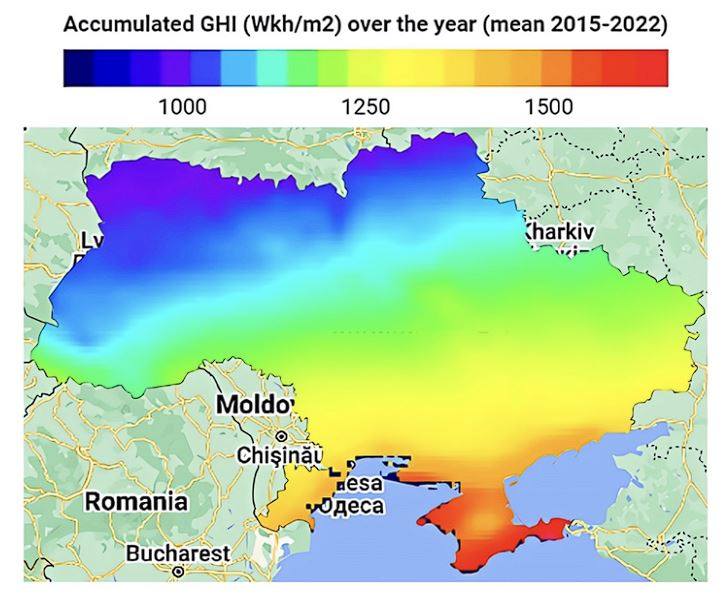
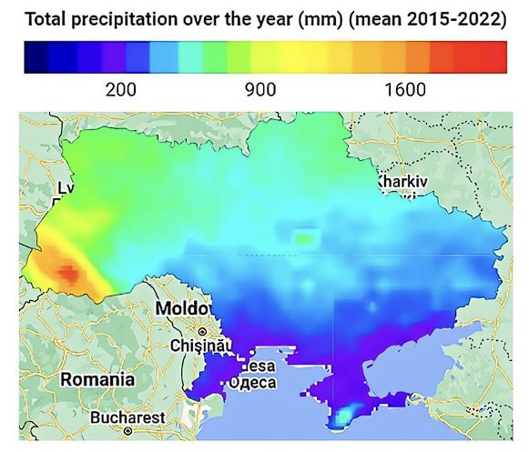
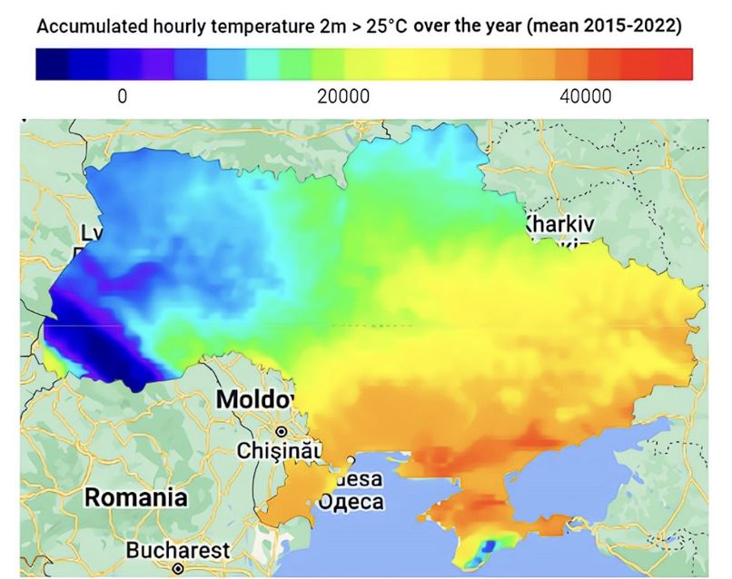
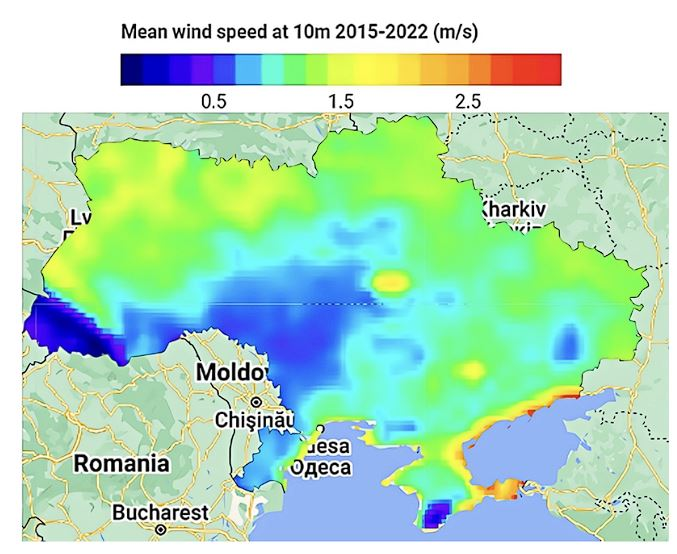

# ІНФОРМАЦІЙНІ ТЕХНОЛОГІЇ ГЕОПРОСТОРОВОГО АНАЛІЗУ РОЗВИТКУ СІЛЬСЬКИХ ТЕРИТОРІЙ І ГРОМАД
## Код
### Робоча книга GEE
https://code.earthengine.google.com/a7fef8406c8afd936426d51ddc0644da
## Набори даних
### Клімат
**GEE колекція "ERA5-Land Monthly Aggregated - ECMWF Climate Reanalysis"** 
https://developers.google.com/earth-engine/datasets/catalog/ECMWF_ERA5_LAND_MONTHLY_AGGR

Підготовлені дані по температурі повітря, швидкості вітру, опадам, освітленості земної поверхні

https://s3.waw3-1.cloudferro.com/swift/v1/smart_village_mon/datasets/climate/GEE/ghi_n.tif (освітленість)

https://s3.waw3-1.cloudferro.com/swift/v1/smart_village_mon/datasets/climate/GEE/prec_n.tif (опади)

https://s3.waw3-1.cloudferro.com/swift/v1/smart_village_mon/datasets/climate/GEE/temp_n.tif (температура)

https://s3.waw3-1.cloudferro.com/swift/v1/smart_village_mon/datasets/climate/GEE/wind_n.tif (швидкість вітру)

### Екологія
Дані по рельєфу
https://s3.waw3-1.cloudferro.com/swift/v1/smart_village_mon/datasets/ecology/GEE/relief.rar
### Економіка
### Інфраструктура
## Продукти
Карта з зонами доцільності розміщення генеруючих сонячних потужностей

https://s3.waw3-1.cloudferro.com/swift/v1/smart_village_mon/products/best_map_final.rar
